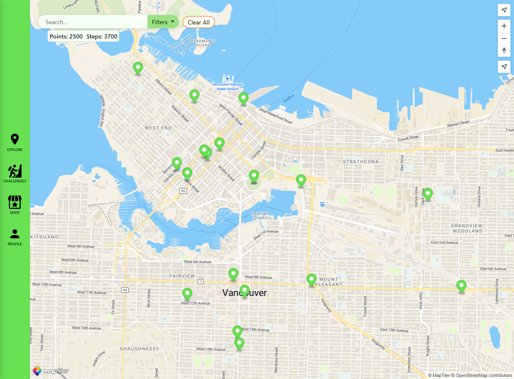
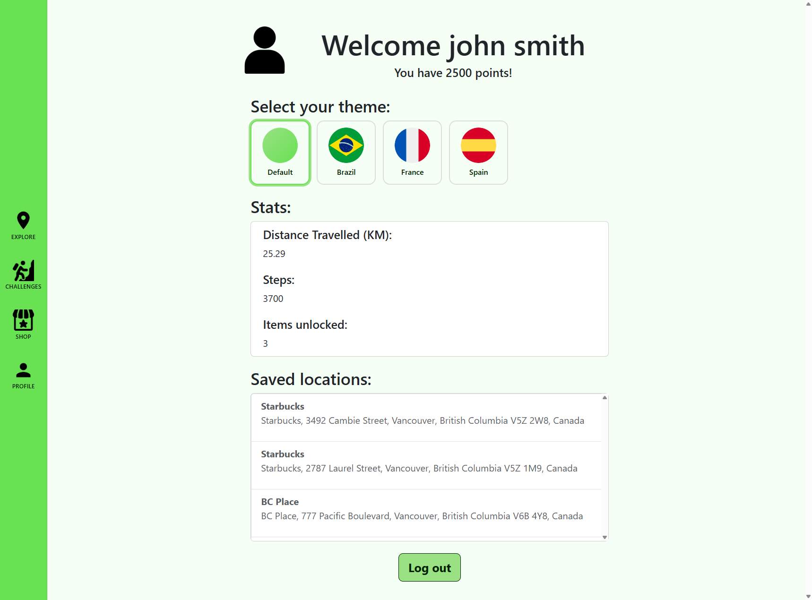

# Guide19
## Overview

Our team, G19, is developing a game-ified local map of downtown Vancouver that will encourage people to walk and explore the city, thus ideally reducing traffic issues caused by large events.

Developed for the COMP 1800 course, this project applies User-Centered Design practices and agile project management, and demonstrates integration with Firebase backend services for storing user favorites.

Live demo [here](https://pg19-7adba.web.app/).

---
## Table of Contents
* [Overview](#overview)
* [Features](#features)
* [Screenshots](#screenshots)
* [Technologies Used](#technologies-used)
* [Usage](#usage)
* [Project Structure](#project-structure)
* [Contributors](#contributors)
* [Acknowledgements](#acknowledgments)
- [Limitations and Future Work](#limitations-and-future-work)
- [License](#license)

---
## Features

- View a map with route setting, location saving, and filters
- Complete challenges by exploring the city
- Purchase items from the shop such as new themes
- Customize your theme from the profile page to support your favourite team
- Responsive design built for mobile and desktop

---
## Screenshots


> The main page with the map


> The profile page with switchable themes

---
## Technologies Used

- **Frontend**: HTML, CSS, JavaScript, [Bootstrap](https://getbootstrap.com/)

- **Backend**: [Maptiler](https://www.maptiler.com/), [ORS](https://openrouteservice.org/), Geolocation API

- **Build Tool**: [Vite](https://vitejs.dev/)

- **Backend**: Firebase for hosting

- **Database**: Firestore

---
## Usage

To run the application locally:

1.  **Clone** the repository.

2.  **Install dependencies** by running `npm install` in the project root directory.

3.  **Start the development server** by running the command: `npm run dev`.

4.  **Open your browser** and visit the local address shown in your terminal (usually `http://localhost:5173` or similar).

Once the application is running:

1. View the map displayed on the main page
2. Create an account and login to view challenges, the shop and your profile page
3. Go out and explore!

---
## Project Structure

```text
1800_202610_BBY-19/
├── .firebase/
├── app/
│   └── html/
│       ├── challenges.html
│       ├── itemshop.html
│       ├── login.html
│       └── profile.html
├── public/
│   ├── app/
│   ├── css/
│   │   └── defaultTheme.css
│   └── images/
├── src/
│   ├── components/
│   │   ├── map.js
│   │   ├── site-footer.js
│   │   ├── site-location-panel.js
│   │   ├── site-route-panel.js
│   │   └── site-searchbar.js
│   ├── authentication.js
│   ├── challenges.js
│   ├── firebaseConfig.js
│   ├── itemShop.js
│   ├── locations.js
│   ├── loginSignup.js
│   ├── main.js
│   ├── mapFunctions.js
│   ├── profile.js
│   ├── routes.js
│   └── stepCounting.js
├── .firebaserc
├── .gitignore
├── firebase.json
├── firestore.indexes.json
├── firestore.rules
├── index.html
├── package-lock.json
├── package.json
├── README.md
├── seedThemes.js
├── server.js
├── themes.json
└── vite.config.js
```

---
## Contributors

- **Alex Balog** - Hi, I like to play games, read books, and go out for walks!

- **Alex Minty** - I'm here to code games and kick ass. And I'm all out of ass.\
Fun Fact: Chaos is a requirement for fun >:D

- **Simon** - BCIT CST Student, local expert on map APIs

- **Carlos Fonseca** I'm Carlos, I like games and programming and I want to be a game programmer.

---
## Acknowledgments

- Map APIs include [Maptiler](https://www.maptiler.com/), [ORS](https://openrouteservice.org/), Geolocation API
- Some code adapted from AI such as [Chat GPT](https://chatgpt.com/), [Claude](https://claude.ai/)
- Images sourced from [Flaticon](https://www.flaticon.com/)

---
## Limitations and Future Work

### Limitations

- Low rate limit on the free route API
- Limited amount of markers displayed at once on the map
- No accessibility features
### Future Work

- Add a dark mode and other related accessibility features
- Add notifications for the user when progress is made
- Implement titles upon challenge completion, to be displayed on the user's profile

---
## License 

This project is open source and available under the MIT License.
